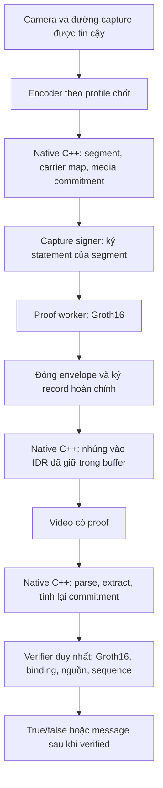

# Future plan — VideoLevel

**Ngày lập:** 29/09/2026.  
**Trạng thái:** Kế hoạch thiết kế và nghiên cứu; các hạng mục tương lai dưới đây chưa được triển khai.  
**Đích đến:** Một hệ thống xác minh video có Groth16 proof bắt buộc, bảo vệ message, nội dung video và nguồn camera; một lõi xử lý media thống nhất; có thực nghiệm trên thiết bị triển khai.

## 1. Các quyết định nền tảng

1. **Cả ba thuộc tính đều bắt buộc:** message đúng, video đúng và nguồn capture được tin cậy. Proof hợp lệ là điều kiện cần; kết quả cuối cùng còn phải khớp video nhận được, chính sách nguồn và toàn bộ phiên ghi hình.
2. **Mọi đường xác minh công khai đi qua cùng một pipeline.** Không có đường chấp nhận chỉ vì HMAC đúng, trích được bytes hoặc FFmpeg giải mã được.
3. **Một lõi media bằng C++.** Python điều phối và gọi dịch vụ proof; Node.js/WASM chạy backend Groth16 hiện tại. Đây là một kiến trúc với các thành phần có trách nhiệm riêng, không duy trì hai thuật toán media làm hai sản phẩm song song.
4. **Bảo vệ cả đoạn video dù chỉ dùng IDR làm nơi chứa proof.** P-frame và, khi được hỗ trợ, B-frame đều phải nằm trong commitment. Không cần nhúng vào mọi frame để xác minh mọi frame.
5. **Chọn strict integrity làm hợp đồng đầu tiên:** chỉnh sửa nội dung được bảo vệ phải bị từ chối. Việc chấp nhận resize, crop hoặc transcode hợp lệ cần một giao thức chứng minh phép biến đổi riêng về sau.
6. **Nguồn camera phải có căn cứ ngoài payload tự khai báo.** Cần trust anchor, đăng ký thiết bị, khóa ký và đường capture có mô hình tin cậy rõ ràng.
7. **Chỉ công bố realtime trên cấu hình đã đo đạt yêu cầu.** Phải tính cả capture, encode, tạo proof, nhúng, vận chuyển và xác minh.

Tên nghiên cứu tạm thời: **Xác thực video H.264 theo đoạn bằng Groth16 và nhúng proof trong bitstream, có ràng buộc nguồn capture.** Tên và phạm vi claim sẽ được chốt sau khảo sát novelty và thực nghiệm.

## 2. Xuất phát điểm của codebase

Các nhận xét này dựa trên source và bằng chứng được lưu trong repository. Lần lập kế hoạch này không chạy lại benchmark hoặc test suite.

| Thành phần | Hiện có | Khoảng cách với mục tiêu mới |
| --- | --- | --- |
| `native/src/cavlc_stream.cpp` | Parse CAVLC theo profile giới hạn, tìm sign-bit carrier, nhúng/trích payload, HMAC framing | Chưa cung cấp giao thức bảo vệ cả video và xác minh nguồn camera bằng Groth16 |
| `src/api/native_handlers.py` | API/stream gọi Native CLI; extract thành công trả `valid=True`; `verify_handler=None` | Trạng thái hiện tại không đồng nghĩa proof đã được kiểm; cần thay hợp đồng API |
| `src/zk_proof.py`, `circuits/payload_verify.circom` | Groth16 cho quan hệ hash payload và secret; bridge sang snarkjs | Chưa có video commitment, camera credential, session chain hay source attestation |
| `src/embedder.py`, `src/verifier.py` | Luồng Python tạo proof, nhúng, trích, verify | Cần chuyển API sang dùng chung native media engine và verifier mới |
| `src/bitstream/`, `src/core/stego.py` | Python parser, safety filter, patch/reconstruct | Giữ làm bản tham chiếu và nghiên cứu trong giai đoạn chuyển đổi; ngừng mở rộng đường production độc lập |
| `src/trust/provenance.py`, `src/provenance/c2pa_bridge.py` | Helper hash/anchor manifest kiểu C2PA | Chưa phải triển khai C2PA đầy đủ hay bằng chứng nguồn camera |
| `src/trust/attestation.py` | `MockTEESigner` dùng HMAC; giao diện attestation | Chưa có hardware attestation hoặc đường sensor-to-signer được bảo vệ |
| `src/trust/fingerprint.py`, các circuit fingerprint/receipt | Thử nghiệm fingerprint và chứng minh tính toán nhỏ | Không thay thế strict integrity hoặc camera provenance |
| Benchmark hiện tại | Có fixture, strict decode, extraction và host E2E | Cần mở rộng dữ liệu, GOP, thiết bị thật, tải dài và security experiments |

Các giới hạn cần mang theo khi lập baseline:

- [README](README.md) ghi nhận prototype, profile có giới hạn và realtime chưa được nghiệm thu trên edge target. Lần camera E2E đã sửa cách đếm source frame đạt 7.608 FPS, chưa đạt cổng 30 FPS của cấu hình đó.
- [NEW_BENCHMARKS](benchmark/NEW_BENCHMARKS.md) mô tả media benchmark dùng 30 frame/case, cấu hình all-intra. Các ảnh 640×480 và 1280×960 được scale từ CIF nên chưa đại diện cho video có độ phân giải gốc cao.
- Tài liệu này ghi 13/27 case có PSNR frame đã sửa dưới 40 dB. Chạy đúng chức năng chưa đồng nghĩa đạt mục tiêu chất lượng.
- [Completion plan](doc/completion_plan.md) và [manifest thiết bị mẫu](doc/edge_deployment_manifest.template.yaml) là nguồn kế thừa cho việc đo đạc; không biến kết quả trên host thành kết quả edge.

## 3. Hợp đồng của verifier

### 3.1. Ý nghĩa của `true`

Với video hữu hạn `V`, trust store `T` và policy do verifier chọn `P`:

```text
Verify(V, T, P) = true
    khi và chỉ khi:
      profile/format được hỗ trợ
      AND có đủ proof hợp lệ cho mọi đoạn bắt buộc
      AND public inputs của proof khớp video và policy thực tế
      AND commitment message khớp chế độ sử dụng
      AND nguồn capture đáp ứng trust policy
      AND thứ tự/độ đầy đủ/final seal của phiên hợp lệ
      AND toàn bộ vùng carrier tuân thủ record đã xác thực.
```

Đây là đặc tả mục tiêu cần chứng minh và triển khai. Chưa phải thuộc tính của code hiện tại.

- API mặc định: `verify(video, trusted_policy) -> bool`.
- API có quyền đọc message: `verify_and_reveal(...) -> verified_message | failure`; chỉ trả message sau khi toàn bộ điều kiện liên quan đạt.
- Nội bộ giữ trạng thái `pending / verified / rejected / incomplete / unsupported / operational_error` để chẩn đoán. Giao diện boolean trả `false` cho mọi trường hợp chưa xác minh thành công; không gán lỗi vận hành thành kết luận chắc chắn có tấn công.
- Với streaming, chỉ công bố phạm vi các đoạn đã verified. Một prefix đúng chưa chứng minh toàn bộ phiên đã hoàn tất.

### 3.2. “Xác minh ngay sau trích xuất”

```text
Nhận bytes có giới hạn
  -> parse profile và trích một envelope hoàn chỉnh
  -> kiểm tra cấu trúc/độ dài/phiên bản và giải nén proof an toàn
  -> Groth16 verify với public inputs được đối chiếu
  -> kiểm tra binding, nguồn, thứ tự và carrier
  -> mới công bố verified hoặc message.
```

Proof thiếu, sai hoặc chưa đủ bytes: không duyệt. Các kiểm tra cú pháp và giới hạn tài nguyên vẫn cần trước verifier để tránh đưa dữ liệu hỏng vào parser/mật mã. “Ngay” nghĩa là sau khi đủ envelope để kiểm, không phải trước khi đã nhận đủ proof hoặc đủ nội dung của đoạn cần bảo vệ.

Không ghi message chưa verified thành artifact có thể tải xuống; không gửi qua WebSocket, callback hoặc log. Nếu parse nội bộ cần đọc message để tính hash thì dữ liệu đó vẫn ở trạng thái chưa tin cậy.

### 3.3. Message và quyền riêng tư

Chọn chế độ mặc định **chỉ trả true/false**, với message ở witness và chỉ mang commitment có salt trong envelope. Không cần đưa plaintext message vào video.

Chế độ tiết lộ message là tùy chọn trong cùng protocol có trường mode được xác thực. Verifier phải kiểm tra opening của commitment trước khi trả nội dung. Nếu yêu cầu giữ bí mật message đối với người nhận video, dùng mã hóa chuẩn và quản lý khóa phù hợp; việc giấu bit hoặc chỉ ẩn message khỏi giao diện không tạo ra tính bí mật.

## 4. Phạm vi bảo vệ và mô hình kẻ tấn công

### 4.1. Đối tượng được bảo vệ

Đơn vị xác minh là một **segment** chứa một hoặc nhiều GOP, có điểm đầu IDR và ranh giới được định nghĩa trong protocol. Điểm bắt đầu triển khai là progressive 8-bit 4:2:0, H.264 Baseline/CAVLC, I/P, một slice/frame theo profile chốt ở P0.

- Hash mọi VCL NAL trong segment, gồm cả frame không chứa payload.
- Ràng buộc NAL header, SPS/PPS đang có hiệu lực, kích thước, tham số giải mã, thứ tự, số access unit và metadata cần để diễn giải segment.
- Có quy tắc cho mọi loại non-VCL NAL: bảo vệ nội dung hoặc từ chối loại chưa hỗ trợ. Không bỏ qua tùy ý byte có thể ảnh hưởng cách diễn giải video.
- Nếu bảo vệ PTS/DTS, chúng phải được đưa vào metadata đã xác thực từ nguồn có chính sách rõ ràng. Raw Annex-B không tự mang đủ timestamp như container.
- B-frame là bước mở rộng riêng: Baseline không hỗ trợ B-slice. Muốn I/P/B phải chọn profile phù hợp và xử lý đúng thứ tự decode/presentation; không chỉ bật B-frame trên baseline rồi coi đã hỗ trợ.
- V1 tập trung vào video elementary stream. Audio và container chưa được bảo vệ thì upload có các track đó phải bị từ chối ở endpoint strict v1, hoặc được xử lý bằng protocol mở rộng trước khi đưa ra claim bao phủ toàn bộ file.

### 4.2. Năng lực đối thủ cần kiểm

Đối thủ biết thuật toán, có video và proof hợp lệ; có thể sửa byte, sửa pixel rồi encode lại, giữ nguyên payload nhưng sửa nơi khác, sao chép proof, tráo nguồn, cắt/nối/đổi thứ tự frame và GOP, replay phiên cũ, sửa manifest và gửi input lỗi. Đối thủ có thể sở hữu một camera đăng ký khác nhưng không được mạo danh camera mục tiêu.

Trust root, policy và registry epoch do verifier lấy từ nguồn tin cậy. Uploader không được tự đưa một root hay verification key mới rồi yêu cầu verifier tin nó.

Các giới hạn phải được phát biểu rõ:

- Tính đúng của nguồn dựa trên mức tin cậy của đường capture đã triển khai. Camera ID hoặc khóa nằm trong file cấu hình chưa đủ.
- TPM/secure element giữ khóa không đồng nghĩa ứng dụng không thể yêu cầu ký video giả. TEE phải có đường vào capture được bảo vệ hoặc có giả định tin cậy tương ứng.
- Video quay lại một màn hình, cảnh được dàn dựng và nội dung sự kiện ngoài đời không được loại trừ chỉ bằng provenance mật mã.
- Đối thủ chặn toàn bộ dữ liệu có thể gây từ chối dịch vụ. Hệ thống cần phát hiện thiếu dữ liệu và giới hạn tài nguyên; không cam kết luôn nhận được video.

## 5. Một kiến trúc triển khai thống nhất



### 5.1. Phân công

| Thành phần | Quyết định |
| --- | --- |
| H.264 parser, access-unit/segment tracking, carrier map, patch/extract, media hash | C++ là implementation chuẩn |
| Capture/encode | Dùng pipeline media phù hợp thiết bị; kiểm chứng encoder và trust boundary trước khi chọn framework |
| Proof generation/verification | Một interface backend; ban đầu dùng Circom + snarkjs đã có, chạy worker có giới hạn |
| API, job, registry, orchestration, báo cáo | Python gọi core và verifier chung |
| Python bitstream implementation | Reference cho các case giao nhau; dữ liệu vàng và decoder độc lập xử lý bất đồng, không mặc định bản Python luôn đúng |
| CLI / HTTP / WebSocket | Cùng protocol, cùng policy, cùng ý nghĩa verified |

Giai đoạn đầu giữ subprocess CLI nếu đáp ứng mục tiêu. Chỉ chuyển sang thư viện C ABI/binding khi đã đo chi phí IPC đáng kể. Không fallback âm thầm từ native sang Python khi native từ chối cú pháp.

### 5.2. Khi nào chuyển thêm sang C++?

Chỉ thực hiện khi có số đo cho thấy một yêu cầu cụ thể bị chặn: bộ nhớ/runtime trên thiết bị, cold start, latency của bridge, hoặc độ phức tạp triển khai. Giữ nguyên protocol và bộ vector đối chiếu trong quá trình thay backend.

Groth16 verifier có thể chuyển backend trước prover nếu thiết bị cần verify độc lập. C++ không làm số constraint của circuit tự giảm. Không tự viết pairing/curve/signature để đạt mục tiêu “full C++”.

## 6. Bài toán trọng tâm: nhúng làm đổi video

Nếu hash video gốc rồi nhúng proof, hash của video đầu ra thay đổi. Nếu proof cần hash chính video đã chứa proof, thiết kế tạo phụ thuộc vòng. Hơn nữa, loại hết carrier bits khỏi hash sẽ để lại một vùng có thể bị sửa mà commitment không phát hiện.

**Đây là hạng mục thiết kế bắt buộc ở P1–P2, không được coi là đã giải quyết chỉ bằng câu “normalize sign bits”.**

### 6.1. Phương án nghiên cứu chính

1. Xác định vùng carrier dành riêng `W_i` bằng thuật toán deterministic từ profile và các đặc trưng cú pháp không đổi khi đổi sign bit. Không dùng chính proof hoặc giá trị sign đang bị sửa làm seed. Verifier tính lại map; không tin danh sách offset do uploader cung cấp.
2. Quy tắc chọn vùng phải hữu hạn, không mơ hồ và nằm trong policy cho phép. Có bootstrap cố định để đọc envelope; trường length/map trong envelope không được mở rộng tùy ý vùng bị bỏ khỏi hash.
3. Tạo biểu diễn chuẩn `N(V_i, W_i)` của segment: đặt các slot dành riêng về giá trị chuẩn; giữ và hash mọi dữ liệu ngoài `W_i` theo encoding xác định.
4. Tính `R_i = H(domain || N(V_i, W_i) || segment_metadata)`. Hash tree theo access unit là tùy chọn để định vị lỗi, không bỏ frame nào khỏi coverage.
5. Capture signer ký statement chứa `R_i`, commitment message, session/sequence, policy, map commitment và khóa phiên được cấp quyền. Proof xác nhận statement được một nguồn hợp lệ xác thực.
6. Sau khi tạo proof, ký record hoàn chỉnh chứa cả proof và public inputs bằng khóa phiên đã được ràng buộc trong statement. Chữ ký ngoài này bảo vệ byte của proof/record; nó không thay thế Groth16.
7. Nhúng encoding duy nhất của record, chữ ký và padding vào `W_i`. Verifier kiểm tra mọi slot dành riêng; slot còn lại ngoài `W_i` vẫn nằm trong media hash.

Chữ ký record được tính trên record không chứa chính trường chữ ký. Đây là cách tránh việc yêu cầu chữ ký hoặc proof hash chính nó. Codec record phải có canonical encoding; thuật toán chữ ký, key validation và quy tắc loại biểu diễn malleable phải được review. Nếu cần claim duy nhất ở mức byte, cần bảo đảm chữ ký mạnh tương ứng, không chỉ viện dẫn khả năng chống tạo message mới.

### 6.2. Những điều phải chứng minh trước khi triển khai rộng

- `W_i` giống nhau trước/sau nhúng; map không đổi khi đối thủ sửa riêng carrier sign bits.
- Thay một byte ngoài vùng normalization được phép dẫn đến thay commitment hoặc input bị từ chối.
- Thay một carrier bit dẫn đến record/signature/proof/padding check thất bại, trừ thay đổi đã được protocol xác định là hợp lệ.
- Proof có thể có nhiều biểu diễn/bản chứng minh cho cùng statement; không lấy tính soundness của Groth16 làm bằng chứng chống sửa byte proof. Chữ ký record và canonical encoding phải bao phủ vấn đề này.
- Nếu dùng ECC, bản strict phải so sánh lại codeword nhận được với encoding chuẩn và từ chối bit đã bị sửa. Việc sửa lỗi rồi trả true chỉ phù hợp một hợp đồng chịu lỗi riêng.
- Writer và verifier phải quy định start codes, emulation-prevention, padding và các byte không được diễn giải. Nếu cho phép khác biệt serialization thì claim phải là integrity của biểu diễn chuẩn, không phải mọi byte file gốc.

Claim v1 là tính toàn vẹn của **video đầu ra sau phép nhúng được cấp quyền** và nội dung nguồn được cam kết ngoài vùng mang record. Không tuyên bố khôi phục bit/pixel nguyên gốc trước nhúng nếu chưa có cơ chế reversible embedding hoặc dữ liệu khôi phục.

P2 là cổng tiếp tục/dừng: nếu còn vùng bit ảnh hưởng hình ảnh mà kẻ không có quyền có thể sửa và vẫn được duyệt, phải sửa giao thức trước khi công bố full-video integrity. Phương án hash file đầu ra rồi ký manifest tách rời được giữ làm baseline đối chiếu và phương án dự phòng có thay đổi hợp đồng rõ ràng; không âm thầm thay yêu cầu proof trong video bằng một root 32 byte.

## 7. Circuit và envelope thế hệ mới

### 7.1. Statement cần chứng minh

Một dạng quan hệ mục tiêu:

```text
Public x:
  media_root, message_commitment, registry_root/epoch,
  session_id, segment_index, previous_record_digest,
  profile/policy_digest, carrier_map_digest,
  session_public_key, finalization_fields.

Private w:
  message, commitment_salt,
  camera credential + registry membership path,
  capture signature và các metadata cần giữ kín.

R(x, w):
  commitment message đúng, có ràng buộc length và encoding;
  credential thuộc registry được tin cậy ở epoch/policy đã chọn;
  capture signature hợp lệ trên statement chứa toàn bộ context x;
  điều kiện chính sách cần chứng minh được thỏa mãn.
```

Verifier tính lại `media_root` từ video nhận được. Không dùng `public.json` do uploader gửi làm chân lý. Hash video ở ngoài circuit là được nếu circuit xác minh chữ ký đáng tin trên chính root đó và verifier tự đối chiếu root; cách này không có nghĩa circuit đã chứng minh toàn bộ decoder H.264.

Mỗi public field phải tham gia constraint hoặc một digest được kiểm trong circuit. Đặc biệt, `payload_length` cần gắn với dữ liệu/message commitment nếu claim nói về độ dài message; chỉ kiểm tra length nằm trong khoảng chưa chứng minh quan hệ này.

### 7.2. ZKP phải có mục đích nghiên cứu rõ

Nếu mọi dữ liệu, danh tính và chính sách đều công khai, chữ ký số trên media root đã giải quyết được nhiều mục tiêu với chi phí thấp hơn. Vì người dùng yêu cầu proof bắt buộc, hướng nghiên cứu đề xuất là **chứng minh video đến từ một camera thuộc tập được cấp quyền, đồng thời giữ kín định danh dài hạn hoặc metadata nhạy cảm**.

Khóa phiên công khai cho phép liên kết các đoạn trong cùng phiên. Không mặc định hứa ẩn danh tuyệt đối; registry nhỏ, timing và metadata vẫn có thể làm lộ nguồn. Chế độ tiết lộ danh tính chính xác có thể dùng opening/credential được xác thực trong cùng protocol.

Policy phải phân biệt “một camera thuộc tập được cấp quyền” với “đúng camera X”. Trường hợp thứ hai cần ràng buộc thêm định danh hoặc commitment thiết bị kỳ vọng trong statement. Camera khác cùng registry không được vượt qua policy camera X; nó có thể hợp lệ trong policy cho phép mọi thành viên của tập.

Một camera USB thông thường không ký trực tiếp được. Nếu capture station ký thay, statement và giao diện phải nói chính xác nguồn được chứng thực là station và camera đã được provision trong đường thu đó. Để claim nguồn sensor mạnh hơn, phải kiểm chứng việc ngăn thay camera/virtual camera/inject frame.

### 7.3. Envelope

Thiết kế schema có version, độ dài tối đa, circuit/verifying-key ID, profile/policy ID, context phiên/đoạn, các commitment, proof, chữ ký record và dữ liệu message tùy mode. Trust store xác định những ID được phép.

- `129 bytes` chỉ là format nén proof Groth16/BN128 hiện tại. Nó không phải tổng overhead của giao thức mới.
- Tính cả public inputs, signature, map/context, framing, padding, certificate references và redundancy vào capacity.
- Quy định endian, domain separation, bit ordering, canonical curve/field encoding và xử lý điểm không hợp lệ/subgroup/infinity theo backend đã kiểm.
- Không cho kẻ gửi đổi verification key, registry root, security mode hay policy để làm một payload sai trở thành hợp lệ.
- Giữ Groth16 làm backend chuẩn ban đầu; đổi curve/backend phải có lý do và đánh giá security level, artifact format, proof size, memory, setup và tốc độ.
- Quản lý hash/version của circuit, R1CS, WASM, proving key và verifying key. Groth16 có setup theo circuit; local setup phục vụ thử nghiệm phải được ghi rõ. Quy trình public release cần provenance và kiểm tra transcript/setup phù hợp. Tham khảo [Groth16](https://eprint.iacr.org/2016/260) và [snarkjs](https://github.com/iden3/snarkjs).

Feasibility spike phải đo việc verify loại chữ ký mà phần cứng thực hỗ trợ bên trong circuit. Không giả định signature gadget, curve và định dạng credential có thể thay thế nhau miễn phí. Nếu dùng khóa phiên thuận lợi cho ZK, phải chứng minh chuỗi cấp quyền từ khóa phần cứng đến khóa phiên, kể cả các ràng buộc context; không đổi sang một chữ ký dễ tính rồi bỏ mất nguồn tin cậy.

## 8. Camera trust, session và khóa

### 8.1. Các bước xây nguồn tin cậy

1. Lập registry cấp quyền nguồn capture; verifier pin trust anchor và registry epoch.
2. Provision khóa thiết bị hoặc khóa station; xác định ai được đăng ký, cập nhật, thu hồi và kiểm tra revocation.
3. Đo luồng camera → driver/ISP → encoder → commitment → signer. Liệt kê thành phần nào được tin và nơi đối thủ có thể inject dữ liệu.
4. Tích hợp secure boot/attestation/TEE/secure element theo khả năng thực của target. Chứng minh bằng thử nghiệm và tài liệu platform mức bảo vệ đạt được.
5. Cấp khóa phiên bằng statement được nguồn capture ký; ký record sau khi có proof. Khóa ký capture và quyền ký record không được dùng lẫn với khóa carrier/HMAC/API.

Không biến `MockTEESigner` thành bằng chứng có TEE bằng cách đổi tên class. Helper hiện tại chỉ là mock để thử giao diện.

### 8.2. Chuỗi segment và kết thúc phiên

- Mỗi segment ràng buộc `session_id`, chỉ số đoạn, phạm vi frame, previous-record digest và context đã ký.
- Verifier giữ state để phát hiện mất, lặp, đảo thứ tự, ghép chéo camera/phiên và rollback registry.
- Video hữu hạn phải có **final seal** chứa số đoạn/frame tổng, đoạn cuối và commitment chuỗi. Đánh dấu terminal trước khi tạo proof cho đoạn cuối, khi segment đó còn trong buffer. Cắt bỏ suffix sẽ thiếu seal hoặc không khớp tổng.
- Mất kết nối/EOF không tự biến prefix thành video hoàn chỉnh. Streaming đang chạy chỉ có trạng thái verified-through-segment-N.
- Live session dùng nonce/challenge và state tin cậy nếu yêu cầu freshness. Timestamp do camera tự ghi không đủ chống replay. Archive verification có thể cho phép mở lại cùng video; phân biệt kiểm nguyên vẹn với xác nhận đang live.
- Verifier offline cần snapshot trust/revocation policy rõ ràng. Không tuyên bố biết revocation mới nhất khi đang offline.

### 8.3. Vai trò của HMAC và chọn vị trí

Đích v2 chọn carrier schedule deterministic, công khai và độc lập giá trị sign để verifier không cần secret của camera. Các đặc trưng dùng chọn vị trí đều nằm trong binding/policy; metadata được kiểm sau extraction không phải nguồn tin độc lập.

HMAC hiện tại được giữ trong quá trình chuyển đổi làm baseline và framing cũ. Khi proof, source signature, record signature và framing v2 đã đạt gate, bỏ HMAC khỏi điều kiện duyệt v2 và bỏ phụ thuộc secret chung để verify. Nếu transport còn cần xác thực đối xứng thì đặt nó ở lớp transport với khóa riêng. Quyết định loại framing cũ phải kèm format version và kiểm tra downgrade.

## 9. GOP, capacity, chất lượng và latency

### 9.1. Rời all-intra theo từng bước

Đầu tiên đo I/P với GOP 8, 16, 32 và cấu hình encoder cố định. GOP=1 tiếp tục là baseline. B-frame là mở rộng sau khi I/P đúng trên thiết bị; phải đo decode/presentation order, buffer và latency riêng.

Chỉ patch IDR nhưng hash toàn bộ segment. P/B bị sửa vẫn phải bị phát hiện từ media root, kể cả payload trong IDR còn nguyên. Đồng thời, thay residual IDR có thể ảnh hưởng chất lượng các frame dự đoán sau nó; phải đo toàn GOP.

### 9.2. Budget thực của một segment

```text
B_required = 8 × (proof + public-input encoding + metadata + signatures
                  + framing + message/ciphertext nếu có) + redundancy_bits
C_usable   = tổng số carrier bit được phép sau giới hạn chất lượng/profile
Điều kiện  = C_usable >= B_required
```

Khi thiếu capacity: gom thêm GOP trong giới hạn latency/memory đã chốt, chọn lại cấu hình encode trước khi ký commitment, hoặc từ chối đoạn. Không duyệt đoạn thiếu proof, không dùng proof của đoạn khác và không giấu việc chỉ bảo vệ một phần video.

Không đặt mục tiêu một proof/frame theo mặc định. Một proof/segment có thể hợp lý hơn, nhưng segment lớn làm tăng độ trễ xác nhận và giảm độ chi tiết định vị lỗi. Nếu muốn dùng proof aggregation/recursion, chỉ làm sau khi đo được lợi ích cụ thể so với tăng segment size.

### 9.3. Tính nhân quả của streaming

Vì proof của segment cần root của cả segment, pipeline được chọn phải **buffer segment rồi mới nhúng vào IDR đầu segment và phát ra**. Không thể phát IDR trước rồi quay lại sửa nó trên luồng đã gửi.

```text
L_verified = thời gian thu segment + encode còn chờ + hash/sign/prove
             + embed + transport + receiver verify
```

Các bước có thể pipeline giữa các segment nhưng verified latency vẫn phải được đo. Tạo proof cho frame tương lai trước khi có dữ liệu không nằm trong thiết kế.

Đo throughput steady-state, backlog và memory của hàng đợi prover. Tốc độ media đạt 30 FPS mà hàng proof tăng mãi thì toàn hệ thống chưa realtime. Nếu offload prover, đo network, thời gian chờ và thông tin witness bị lộ cho máy prover; ZK không che witness khỏi nơi trực tiếp tạo proof.

## 10. Bản đồ thay đổi dự kiến

Các đường dẫn ghi “mới” chỉ là thiết kế; chưa được tạo trong lần lập kế hoạch này.

| Khu vực | Việc cần làm |
| --- | --- |
| `native/src/cavlc_stream.cpp`, header tương ứng | Tách trách nhiệm parse/carrier/stream dần; giữ hành vi bằng vectors; thêm segment và canonical coverage |
| `native/.../video_commitment.*` — mới | Serialize chuẩn, xác định vùng carrier, hash toàn segment, kiểm coverage |
| `native/.../segment.*` — mới | Access units, boundaries, frame accounting và metadata I/P; B sau |
| `src/protocol/` — mới | Schema v2, bounded codec, version/policy/key IDs và vector tương thích |
| `src/verification/` — mới | Một pipeline nhận payload nội bộ, kiểm Groth16 và mọi binding, quản lý state/final seal |
| `src/zk_proof.py` | Adapter có version, worker lifecycle, timeout, registry artifact; giữ đọc v1 riêng theo policy chuyển đổi |
| `circuits/video_attestation_v2.circom` — mới | Quan hệ media/message/source/registry/context theo thiết kế đã review |
| `src/trust/attestation.py` | Giữ mock rõ tên; adapter phần cứng thực riêng, không dùng mock cho release |
| `src/api/app.py`, `src/api/native_handlers.py` | Chuyển các route sản phẩm vào verifier chung; sửa ý nghĩa `valid`; hạn chế raw extraction thành nội bộ |
| `src/embedder.py`, `src/verifier.py` | Facade dùng core/protocol/verifier mới; bỏ backend media chọn tùy ý trên public API |
| `src/bitstream/`, `src/core/stego.py` | Đóng băng reference trước; loại khỏi production dependency sau khi đối chiếu đạt |
| `benchmark/`, `src/runtest/`, `native/tests/` | Attack corpus, integration, differential/fuzz, measurements và báo cáo tái lập |
| `doc/` | Protocol spec, threat model, security argument, target manifest, hướng dẫn tái lập |

## 11. Lộ trình theo cổng nghiệm thu

Thời gian dưới đây là ước lượng cho một người làm tập trung, đã có nền tảng codebase và có thể tiếp cận phần cứng cần thiết. Tổng tuần 23–35, sau đó dành thêm thời gian phản biện/sửa paper. Đây không phải cam kết tiến độ; P0 và cổng phần cứng có thể thay đổi lịch.

| Giai đoạn | Tuần dự kiến | Đầu ra | Điều kiện qua cổng |
| --- | --- | --- | --- |
| P0 — Chốt phạm vi và target | 1–2 | Protocol sketch, trust boundary, target/camera/encoder/profile, bộ baseline được đóng phiên bản | Có định nghĩa true/false, nguồn ký, đơn vị segment, integrity scope và ngân sách có số |
| P1 — Hợp nhất đường chạy | 3–5 | Native media core chuẩn, API/verifier facade chung, typed result và v2 codec skeleton | Mọi đường public dùng cùng pipeline; payload thiếu/sai proof bị từ chối; không công bố đã đạt video/source khi còn dùng circuit cũ |
| P2 — Video binding và self-embedding | 6–10 | Carrier map bất biến, commitment mọi NAL/frame, record seal, chain/final seal | Sửa ngoài payload, sửa carrier, giữ proof mà đổi P-frame, copy/cut/reorder đều bị bắt; không còn lỗ hổng do vùng bỏ hash |
| P3 — Nguồn capture và circuit v2 | 11–16 | Registry, nguồn ký thật, circuit/source credential, key lifecycle và bộ public-input tests | Proof xác minh statement mới; khóa/trust root giả và camera không được phép không được duyệt; capture trust đạt claim đã chọn |
| P4 — GOP và thiết bị | 17–21 | I/P mixed GOP, capacity/quality budget, pipeline bounded trên target | Đạt tất cả ngân sách chốt ở P0; tính cả prover và verifier; low-capacity/timeout không bypass proof |
| P5 — Thực nghiệm paper | 22–29 | Dataset split, baselines, attacks, ablations, thống kê, artifact tái lập | Kết quả có sample count/CI, dùng holdout; có security argument và đối chiếu liên quan |
| P6 — Hoàn thiện đồ án/paper | 30–35 | Demo hoàn chỉnh, luận văn, manuscript, artifact release | Người khác tái lập từ hướng dẫn; claims khớp kết quả; review kỹ thuật trước nộp |

P2 và P3 có nghiên cứu khả thi nhỏ từ P0 để tránh phát hiện vấn đề sau nhiều tháng. Nếu target không có đường capture đủ tin cậy, đánh dấu mục tiêu nguồn camera chưa đạt và giải quyết phần cứng/mô hình trước khi chốt claim. Không dùng mock để hoàn tất cổng này.

### Việc đầu tiên sau khi chấp nhận kế hoạch

- [ ] Viết `doc/protocol_v2.md` với bytes được bảo vệ, schema, state machine và statement circuit.
- [ ] Điền target manifest bằng thiết bị/camera/encoder cụ thể; kiểm tra chúng hỗ trợ cấu hình H.264 cần dùng.
- [ ] Đóng baseline hiện tại bằng commit/artifact hash; phân biệt legacy, native và experimental trust modules.
- [ ] Lập threat-model table và các case “payload còn nguyên nhưng video sai”.
- [ ] Làm feasibility spike về carrier normalization + envelope sealing, signature/credential verification trong circuit và tốc độ trên target.
- [ ] Chốt ngân sách capacity, chất lượng và verified latency trước benchmark chọn cấu hình.

## 12. Chiến lược nghiên cứu cho paper

### 12.1. Những gì đã có trong nghiên cứu trước

Không nên claim mới chỉ từ việc dùng H.264, watermark, GOP authentication, TEE hay ZKP. Các nguồn chính đã kiểm tra khi lập kế hoạch:

| Công trình/chuẩn | Điều đã có và ảnh hưởng đến đề tài |
| --- | --- |
| [PhotoProof, IEEE S&P 2016](https://cs-people.bu.edu/tromer/photoproof/) | Chứng minh ảnh xuất phát từ ảnh đã ký qua các biến đổi cho phép. Cần phân biệt bài toán video streaming và in-band carrier của đề tài |
| [Vronicle, MobiSys 2022](https://www.microsoft.com/en-us/research/publication/vronicle-verifiable-provenance-for-videos-from-mobile-devices/) | Xác minh nguồn camera và chuỗi xử lý video với TEE. “Camera provenance” tự nó đã có tiền lệ |
| [VIMz, PoPETs 2025 — artifact của tác giả](https://github.com/zero-savvy/vimz/) | Chứng minh xử lý ảnh bằng folding-based zkSNARKs và giữ kín thông tin; cần đối chiếu privacy, computation và artifact cùng statement |
| [Fragile watermarking scheme for H.264 video authentication, 2010](https://doi.org/10.1117/1.3309472) | Xác thực H.264 bằng fragile watermark đã được nghiên cứu từ lâu |
| [A Fragile Watermarking Method for Content-Authentication of H.264-AVC Video, 2023](https://jisis.org/wp-content/uploads/2023/06/2023.I2.014.pdf) | Có cơ chế GOP authentication và thông tin thứ tự; không thể lấy riêng GOP hash/sequence làm novelty |
| [Video Seal — bài báo](https://arxiv.org/abs/2412.09492), [mã tác giả](https://github.com/facebookresearch/videoseal) | Baseline robust watermark hiện đại cho độ bền/capacity/chất lượng; mục tiêu robust khác strict integrity nên cần trình bày hai trục riêng |
| [C2PA 2.4, mục Binding to Content](https://spec.c2pa.org/specifications/specifications/2.4/specs/C2PA_Specification.html) | Phân biệt hard binding mật mã và soft binding để nhận diện/tìm lại nội dung. Không dùng fingerprint làm bằng chứng thay thế toàn vẹn mật mã |

Đây là khảo sát khởi đầu, chưa phải systematic literature review. P0/P5 phải mở rộng và lập bảng “công trình — threat model — điểm tin cậy — frame coverage — privacy — in-band overhead — thiết bị — bằng chứng”. Ghi phiên bản/code commit và ngày truy cập 29/09/2026 cho các nguồn trên, cập nhật trước nộp.

### 12.2. Ba câu hỏi nghiên cứu đề xuất

**RQ1 — Binding:** Có thể dùng carrier CAVLC bất biến độ dài để mang proof, đồng thời xác thực mọi frame và mọi vùng có thể bị sửa, với security argument rõ ràng cho self-embedding không?

**RQ2 — Privacy và nguồn:** Có thể chứng minh một segment được nguồn capture thuộc tập cấp quyền xác thực mà không công khai định danh dài hạn/metadata riêng, với chi phí khả thi trên pipeline triển khai không?

**RQ3 — Hiệu quả hệ thống:** Trên video có GOP thông thường, lựa chọn segment size, GOP và carrier budget nào đạt điểm cân bằng tốt giữa chất lượng, tỷ lệ đủ capacity, độ trễ verified, năng lượng và thông tin riêng tư?

RQ1/RQ2 là đóng góp cần chứng minh, RQ3 là đóng góp thực nghiệm/hệ thống. Tính mới còn là giả thuyết; không dùng từ “đầu tiên” hay “state of the art” trước khi khảo sát và so sánh đủ.

### 12.3. Security argument cần có

Phát biểu completeness và định nghĩa acceptance sai: thay media ngoài phép nhúng được cấp quyền, thay message/context, giả nguồn, chèn/cắt/đổi thứ tự hoặc bypass finalization mà vẫn true. Phân tích theo các giả định hash collision resistance, signature security, SNARK soundness, trust anchor và trusted capture.

Đặc biệt phân tích carrier exclusion, proof/record malleability, credential của camera độc hại đã đăng ký, hash/parser ambiguity và khả năng bỏ qua segment. Đánh giá thực nghiệm không thay thế lập luận mật mã; test “không lọt attack” chưa phải định lý bảo mật.

## 13. Thiết kế thực nghiệm

### 13.1. Baseline công bằng

| Baseline | Mục đích |
| --- | --- |
| Hệ thống Native hiện tại, cố định version | Đo chi phí bổ sung của video/source/proof enforcement |
| Media root + chữ ký nguồn, lưu manifest/SEI hoặc kênh metadata | Baseline tối thiểu cho integrity/provenance; cần để giải thích lợi ích và chi phí thật của ZK/in-band carriage |
| Cùng protocol nhưng công khai credential/chữ ký, không ZK | Ablation privacy/chi phí; chỉ dùng nghiên cứu, không là chế độ production bỏ proof |
| Fragile H.264 authentication gần bài toán nhất, có code hoặc mô tả tái hiện được | So sánh bitstream embedding, frame coverage và attack behavior |
| VideoSeal hoặc baseline robust có code tác giả | So sánh payload/chất lượng/khả năng tìm lại sau biến đổi; không xem việc nó chịu được transcode là lỗi integrity của nó |
| Python reference trên tập cú pháp cùng hỗ trợ | Đo giá trị của native engine trên cùng công việc; không so hai pipeline khác nhau rồi quy hết chênh lệch cho ngôn ngữ |

Không chỉ so thời gian HMAC, RSA và Groth16 như thể chúng bảo vệ cùng một thuộc tính. Nếu so các proof system thì dùng cùng statement, mức an toàn và cách tính setup/prove/verify được khai báo.

### 13.2. Dữ liệu và chia tập

- Mục tiêu lập kế hoạch: 50–100 clip độc lập, nhiều nguồn/cảnh, gồm chuyển động mạnh, ít texture, ánh sáng yếu, scene cut và các đoạn rất ít carrier. Chốt số lượng qua pilot, power/CI và tài nguyên; không coi đây là bảo đảm chất lượng paper.
- Có video ở độ phân giải gốc 720p/1080p, không thay bằng upscale CIF. Bộ CIF hiện tại giữ để so sánh lịch sử.
- Bổ sung camera thật ở ít nhất hai điều kiện/cấu hình thiết bị; phải có ít nhất một target triển khai thực. Công bố license/quyền sử dụng và metadata phù hợp.
- Chia development/tuning/test theo nguồn video/camera/cảnh. Không lấy frame lân cận của cùng clip vào cả tuning và test rồi coi độc lập.
- Không bỏ clip thiếu capacity ra khỏi mẫu số. Báo success coverage và các nguyên nhân thất bại theo độ phân giải/GOP/scene.
- Benchmark đủ toàn clip được chọn, không chỉ 30 frame đầu. Nếu lấy window, công bố cách lấy, độ dài và giới hạn suy luận.

### 13.3. Attack matrix bắt buộc

1. Payload: mất proof, proof lỗi, curve encoding lỗi, đổi message/length, tráo public inputs, sai verifying-key/policy ID.
2. Media: sửa IDR/P/B nơi không mang payload, sửa syntax nhưng vẫn decodable, thay SPS/PPS, giữ nguyên payload rồi đổi vùng hình ảnh.
3. Temporal: cắt đầu/đuôi/giữa, duplicate/drop/reorder frame và GOP, ghép hai camera/phiên, replay đoạn cũ và replay toàn phiên trong live mode.
4. Carrier: đổi sign slot, padding, bootstrap header, candidate-map manipulation, tráo proof hợp lệ sang video khác, thay bytes của proof cùng statement.
5. Nguồn: camera chưa đăng ký, credential hết hạn/thu hồi, registry giả/rollback, dùng camera hợp lệ khác để mạo danh, virtual camera/frame injection vào capture path.
6. Biến đổi phổ biến: transcode, resize, crop, rewrap, sửa timestamp. Kết quả kỳ vọng phải theo strict scope; không gọi reject một phép biến đổi ngoài policy là “false negative”.
7. Vận hành: input truncated, packet loss, timeout prover, disconnect/restart, full queue, capacity thiếu, out-of-order jobs, oversized NAL/envelope và decoder disagreement.

### 13.4. Metric và cách báo cáo

| Nhóm | Phải đo |
| --- | --- |
| Đúng chức năng | strict decode, extracted bits, proof/binding/source verdict, completeness/final seal |
| Bảo mật thực nghiệm | false accept/reject theo từng loại attack, N mẫu độc lập, coverage và khoảng tin cậy |
| Capacity | raw candidates, slots được phép, overhead đầy đủ, useful bits/s, tỷ lệ đoạn đủ capacity |
| Chất lượng | PSNR/SSIM theo frame và GOP; mean, minimum, percentile, modified-frame subset; ảnh ví dụ và temporal drift |
| Hiệu năng | capture/encode/hash/sign/prove/embed/transport/verify riêng; tổng throughput và verified latency p50/p95/p99 |
| Tài nguyên | memory cả process tree, queue depth, CPU, power/energy, temperature/throttling |
| Giao thức | bytes/proof và bytes/segment toàn bộ; bitrate tăng, registry/certificate fetch và cache misses |
| Privacy | dữ liệu công khai, witness, disclosure cho prover, khả năng liên kết phiên và leakage metadata |

Chất lượng phải so cả với raw source và clean encoded video để tách tác động nén với tác động nhúng. Không để nhiều frame không sửa che khuất chất lượng thấp của frame bị sửa.

Lặp ít nhất 5 run độc lập cho cấu hình chính nếu khả thi; báo warm/cold riêng. Dùng clip/phiên làm đơn vị thống kê và paired comparison khi phù hợp. Không coi hàng nghìn frame liên tiếp là hàng nghìn mẫu camera độc lập. Với 0 false accept trên N thử nghiệm độc lập, upper bound 95% xấp xỉ 3/N chỉ mô tả phép đo; không suy ra security level mật mã.

### 13.5. Ablation

- GOP=1 so với I/P mixed GOP; segment dài ngắn; chỉ IDR-hash so với all-frame hash.
- Không chain/final seal so với bản đầy đủ, để chỉ ra attack cắt/ghép.
- Chỉ mask carrier bits so với kiểm cả record/padding, để kiểm lỗ hổng exclusion.
- Công khai credential so với ZK membership; prover local so với offload nếu thực hiện.
- Các carrier budget/quality policies và trạng thái thiếu capacity.
- Native engine so với reference trên cùng tập cú pháp và workload.

Những cấu hình cố ý bỏ kiểm tra chỉ tồn tại trong harness nghiên cứu; không biến thành flag bỏ proof trên API sản phẩm.

## 14. Nghiệm thu trên thiết bị

P0 phải ghi board/SoC, OS/kernel, compiler, crypto backend, camera/sensor, interface, driver, encoder, profile, GOP, bitrate/QP, resolution/FPS, network và phiên bản firmware. Xác minh khả năng xuất CAVLC của encoder thật; không mặc định hardware encoder hỗ trợ profile đang cần.

Ngân sách cần chốt trước thực nghiệm chính:

| Đại lượng | Quy tắc chốt |
| --- | --- |
| FPS nguồn | Chọn đúng mode nguồn, ví dụ 30 hoặc 30000/1001; dùng frame nguồn duy nhất và active duration, khai báo sai số đo |
| Verified latency | Chốt theo segment duration cộng ngân sách prover/transport/verifier; không chỉ đo native patch vài ms |
| Quality | Mục tiêu ban đầu để nghiên cứu: incremental Y-PSNR frame bị sửa ≥ 40 dB và SSIM ≥ 0.98; phải kiểm cả GOP và báo thất bại, không tự hạ sau khi thấy kết quả |
| Capacity coverage | Có mục tiêu tỷ lệ scene/segment được phục vụ; trường hợp không đạt vẫn phải fail closed |
| Memory/queue/power | Giới hạn bằng số theo target; overload không được phát video với nhãn verified |
| Soak | Smoke 60 giây, acceptance ít nhất 30 phút và thêm một run 2 giờ cho cấu hình chính nếu khả thi |

Không dùng frame do FFmpeg duplicate để đạt FPS. Tách timestamp cảm biến, capture completion, encode output và application receipt. Nếu chưa có đồng hồ cảm biến đáng tin thì chỉ báo latency của ranh giới đã đo, không gọi là sensor-to-verifier latency.

Đo trên LAN/đường truyền dự kiến, gồm TLS khi triển khai dùng TLS. Loopback chỉ là một baseline. Các ca mất nguồn, restart, mất mạng và thay đổi scene phải có verdict đúng và queue hữu hạn.

## 15. Chất lượng phần mềm và artifact nghiên cứu

- Viết specification và vector serialization trước khi thay cả Python/C++.
- Test các public input bị đổi độc lập, witness trái phép, field/range constraints và credential hết hạn. Review circuit về unconstrained input; proof tạo được chưa chứng minh circuit đúng ý định.
- Fuzz parser NAL/CAVLC/envelope; chạy sanitizers phù hợp trên native code; giới hạn kích thước, số frame, recursion và thời gian mọi bước.
- Đối chiếu decoder độc lập cho đầu ra; tính an toàn syntax và chất lượng hình ảnh là hai gate riêng.
- Pin dependency, công cụ encode, backend crypto, circuit artifacts và input hashes. Tách setup, build, warm-up và measurement.
- CI có functional corpus nhỏ; benchmark dài và thiết bị thật chạy theo lịch riêng. Test phải kiểm cả false verdict và trường hợp không có test thực chạy.
- Artifact paper gồm mã, scripts, cấu hình target, seed, dataset manifests, raw CSV/JSON, notebook tạo bảng/hình và failed cases. Không đưa khóa camera thật/witness nhạy cảm vào artifact công khai.
- Có người khác tái lập ít nhất một subset từ máy sạch; đính kèm log và giới hạn không tái lập được.

## 16. Đồ án hoàn chỉnh và cổng nộp paper

### 16.1. Demo đồ án

Một demo mạnh cần chứng minh được các hành vi sau trên cùng pipeline:

1. Camera nguồn hợp lệ → video có proof → verifier trả true và hiển thị phạm vi đã xác minh.
2. Sửa P-frame trong khi giữ payload IDR → false.
3. Copy proof/video segment giữa hai phiên hoặc hai camera → false.
4. Thiếu/sai proof → false; không lộ message qua endpoint/artifact.
5. Thiếu carrier hoặc prover trễ → pending/failure có lý do; không đánh dấu verified.
6. Cắt đuôi video → không có xác nhận toàn phiên do final seal thiếu/sai.
7. Chứng minh camera thuộc registry, với chế độ tiết lộ hoặc giữ kín thông tin đúng như statement đã thiết kế.

Giao diện chỉ cần timeline đoạn và verdict dễ hiểu, camera trust status, độ trễ verified và lỗi chính. Sức nặng của đồ án đến từ hệ thống có thể kiểm chứng, source/documentation và thực nghiệm đầy đủ.

### 16.2. Điều kiện đủ để tự đánh giá “hoàn chỉnh”

- [ ] Một media engine và một verifier policy cho CLI/API/stream.
- [ ] Groth16 đúng là bắt buộc trên mọi đường sản phẩm.
- [ ] All-frame binding và carrier coverage được triển khai, có security argument và negative tests.
- [ ] Nguồn capture thật đáp ứng trust claim; mock không nằm trên đường acceptance.
- [ ] Sequence, freshness theo mode và final seal hoạt động.
- [ ] Capacity/quality/latency đạt trên target đã chốt; không có proof backlog vô hạn.
- [ ] Key/setup/registry/revocation lifecycle được mô tả và kiểm tra.
- [ ] Có benchmark tái lập và demo các trường hợp sai khó, không chỉ video mẫu thành công.

### 16.3. Điều kiện chuẩn bị nộp Q1–Q2

Cần đóng góp mới được phân biệt với công trình gần nhất, mô hình bảo mật có giới hạn rõ, so sánh công bằng, kết quả holdout, thống kê và artifact tái lập. Q1/Q2 là mục tiêu xuất bản, không phải kết quả có thể bảo đảm bằng số tính năng hoặc số dòng code.

Chọn journal sau khi biết đóng góp mạnh nhất nằm ở multimedia/forensics, applied security hay systems. Kiểm tra scope, hệ thống xếp hạng mà trường chấp nhận, category và năm cụ thể; không gán quartile chỉ theo tên tạp chí. Manuscript nên có: problem/threat model, protocol, security analysis, implementation, evaluation, limitations và reproducibility.

### 16.4. Các mở rộng để sau

Robust watermark/fingerprint để tìm lại provenance sau transcode; chứng minh edit hợp lệ; C2PA interoperability thực; multi-slice/B-frame/CABAC/HEVC/AV1; recursive proof aggregation. Mỗi mở rộng phải có câu hỏi và ngân sách riêng. AI detector, blockchain và viết lại toàn bộ bằng C++ không phải điều kiện mặc định để đạt ba mục tiêu chính.

**Ưu tiên thực hiện:** chốt threat model và nguồn capture → chứng minh binding không có vùng bỏ sót → hợp nhất pipeline và bắt buộc proof → hoàn thiện circuit/source trust → đo mixed GOP trên target → thực nghiệm và paper.
